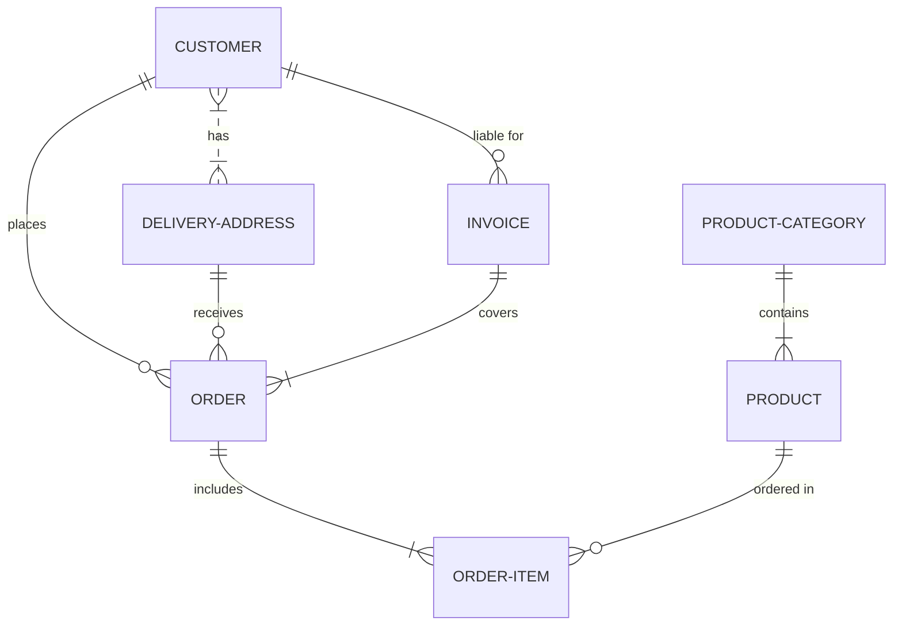

# PRESENTACIÓN: Sistema de Gestion de Informacion para Clinica Veterinaria

**Asignatura**: Bases de Datos I (FaCENA-UNNE)

**Integrantes**:
 - Beck, Pablo 
 - Belucci, Lautaro
 - Hamm, Abdul
 - Silva, Estela Maris

**Año**: 2024

# Indice
- **Capítulo I:** Introducción
- **Capítulo II:** Marco Conceptual o Referencial
- **Capítulo III:** Metodología
- **Capítulo IV:** Desarrollo del Tema/Resultados
- **Capítulo V:** Conclusiones
- **Capítulo VI:** Bibliografía

## CAPÍTULO I: INTRODUCCIÓN
### *Caso de estudio*

Una clínica veterinaria desea implementar una base de datos para gestionar la información de
sus pacientes (mascotas), dueños, citas médicas y tratamientos. 

- Cada mascota tiene un código único de identificación. Se desea almacenar el nombre,
especie (perro, gato, ave, etc.), raza, fecha de nacimiento, peso y cualquier condición
médica especial en caso de existir. Ej: Alérgico a droga (Nombre droga) 
- Los dueños de las mascotas son registrados con un número de identificación único.
Además, se almacenan datos personales como DNI, nombre, dirección, teléfono y
correo electrónico. 
- Las citas medicas son espontaneas y se registran al momento de la visita de la mascota
a la veterinaria. 
- Se registra el motivo de la cita, el veterinario asignado y cualquier observación posterior
a la cita. Una cita está asociada a una única mascota y a un único veterinario. 
- De cada veterinario se desea guardar su número de licencia profesional, nombre
completo, especialidad (si la tiene, por ejemplo, ortopedia, oftalmología, etc.) y horario
de atención. 
- Si a una mascota se le prescribe un tratamiento, se desea registrar el nombre del
tratamiento, duración, Medicamentos indicados y cualquier otra indicación relevante. 
- El tratamiento, en caso de existir, debe estar asociado a una cita. 
- En una misma cita, el veterinario puede indicar mas de un tratamiento. 
- Un tratamiento debe permitir la aplicación de varios medicamentos 
- De los medicamentos se necesita conocer: Nombre comercial, monodroga, presentación
y laboratorio que lo comercializa. 

Se deben considerar las siguientes restricciones en el diseño físico: 
- La longitud del campo ‘dni’ debe ser igual o menor a 8 caracteres 
- El campo ‘correo_electronico’ debe ser un valor único. 
- El campo ‘fecha’ por defecto toma la fecha actual. 
- La edad de la mascota no puede superar los 30 años. 
- Se debe registrar en forma automática la fecha del sistema y usuario de base de datos
que crean los registros de citas. Agregar estos dos campos a la tabla. 

### Tema: Implementacion de una Base de datos para la Gestion de una Clinica Veterinaria.

**Definicion del Problema:** La clínica veterinaria necesita una solución para gestionar eficientemente la información de sus pacientes, dueños, citas médicas y tratamientos. 

### *Objetivo del Trabajo Práctico*
**Objetivo General:** Desarrollar una base de datos que permita la gestión integral de la información en una clínica veterinaria. 
**Objetivos Específicos:**
- Implementar el manejo de permisos a nivel de usuarios. 
- Crear procedimientos y funciones almacenadas para la gestión de datos. 
- Optimizar consultas mediante el uso de índices. 

**Requisitos:** 
- *Mascotas:* Código único, nombre, especie, raza, fecha de nacimiento, peso, condiciones médicas especiales.
- *Dueños:* Número de identificación único, DNI, nombre, dirección, teléfono, correo electrónico.
- *Citas Médicas:* Motivo de la cita, veterinario asignado, observaciones, asociada a una mascota y un veterinario.
- *Veterinarios:* Número de licencia profesional, nombre completo, especialidad, horario de atención.
- *Tratamientos:* Nombre del tratamiento, duración, medicamentos indicados, indicaciones relevantes, asociado a una cita.
- *Medicamentos:* Nombre comercial, monodroga, presentación, laboratorio.

**Objetivos:** 
- Mejorar la organización y acceso a la información de mascotas y dueños. 
- Facilitar el registro y seguimiento de citas médicas y tratamientos. 
- Asegurar la integridad y seguridad de los datos. 

## CAPITULO II: MARCO CONCEPTUAL O REFERENCIAL

### **TEMA 2: Procedimientos y Funciones Almacenadas** 
### *¿Qué son?*
- **Procedimientos Almacenados:** Son bloques de código SQL que se guardan en la base de datos y se pueden ejecutar múltiples veces. Por ejemplo, puedes tener un procedimiento que registre una nueva cita médica para una mascota.

- **Funciones Almacenadas:** Son similares a los procedimientos, pero su propósito principal es devolver un valor. Por ejemplo, puedes tener una función que calcule la edad de una mascota a partir de su fecha de nacimiento.

### *Importancia y Uso*
En el contexto de la clínica veterinaria, los procedimientos y funciones almacenadas ofrecen varias ventajas:
- **Eficiencia:** Permiten ejecutar operaciones complejas de manera rápida y repetitiva sin necesidad de reescribir código. Por ejemplo, un procedimiento puede registrar automáticamente una cita y asociarla a la mascota y al veterinario correspondiente.

- **Seguridad:** Se pueden otorgar permisos específicos a los usuarios para ejecutar estos procedimientos y funciones, manteniendo la integridad de la base de datos. Así, el personal puede registrar citas sin tener acceso completo a toda la base de datos.

- **Mantenimiento:** Facilitan el mantenimiento del código. Si se necesita realizar un cambio en la forma en que se registra una cita, solo hay que actualizar el procedimiento almacenado una vez, en lugar de cambiar cada consulta SQL que se use en la aplicación. 

Los procedimientos y funciones almacenadas son herramientas poderosas en la gestión de bases de datos. En una clínica veterinaria, su implementación no solo optimiza el manejo de datos, sino que también mejora la seguridad y el mantenimiento de la información crítica sobre mascotas, dueños, citas y tratamientos. Al utilizarlas, puedes asegurar un sistema de gestión más eficiente y confiable.

**TEMA 2 " ----- "** 
Ut sed imperdiet risus. Maecenas vestibulum arcu vitae orci pretium pharetra. Suspendisse potenti. Fusce massa libero, fermentum eget elit in, tincidunt fermentum nunc. Cras imperdiet nisl elit, elementum gravida enim accumsan vel. Sed in sapien quis ante consectetur commodo id non nulla. Aenean lacinia, dolor convallis semper mattis, ante orci elementum nunc, eget feugiat risus neque in urna. Ut ut quam nec risus mollis convallis ornare ac odio. Phasellus efficitur posuere nibh, eget tempor augue pellentesque ac. Ut enim sem, imperdiet non est ut, blandit posuere dui. Curabitur at purus orci. Interdum et malesuada fames ac ante ipsum primis in faucibus.

...

## CAPÍTULO III: METODOLOGÍA SEGUIDA 

Donec lobortis tincidunt erat, non egestas mi volutpat in. Cras ante purus, luctus sed fringilla non, ullamcorper at eros.

 **a) Cómo se realizó el Trabajo Práctico**
Vestibulum rutrum feugiat molestie. Nunc id varius augue. Ut augue mauris, venenatis et lacus ut, mattis blandit urna. Fusce lobortis, quam non vehicula scelerisque, nisi enim ultrices diam, ac tristique libero ex nec orci.

 **b) Herramientas (Instrumentos y procedimientos)**
Donec lobortis tincidunt erat, non egestas mi volutpat in. Cras ante purus, luctus sed fringilla non, ullamcorper at eros. Integer interdum id orci id rutrum. Curabitur facilisis lorem sed metus interdum accumsan. 

## CAPÍTULO IV: DESARROLLO DEL TEMA / PRESENTACIÓN DE RESULTADOS 

Maecenas molestie lacus tincidunt, placerat dolor et, ullamcorper erat. Mauris tortor nisl, ultricies ac scelerisque nec, feugiat in nibh. Pellentesque interdum aliquam magna sit amet rutrum. 

### Diagrama conceptual (opcional)
Ejemplo usando Live Editor https://mermaid.js.org/ (ejemplo opcional)

### Diagrama relacional

### Diccionario de datos

Acceso al documento [PDF](doc/diccionario_datos.pdf) del diccionario de datos.

### Desarrollo TEMA 1 "----"

Fusce auctor finibus lectus, in aliquam orci fermentum id. Fusce sagittis lacus ante, et sodales eros porta interdum. Donec sed lacus et eros condimentum posuere. 

> Acceder a la siguiente carpeta para la descripción completa del tema [scripts-> tema_1](script/tema01_nombre_tema)

### Desarrollo TEMA 2 "----"

Proin aliquet mauris id ex venenatis, eget fermentum lectus malesuada. Maecenas a purus arcu. Etiam pellentesque tempor dictum. 

> Acceder a la siguiente carpeta para la descripción completa del tema [scripts-> tema_2](script/tema02_nombre_tema)

... 

## CAPÍTULO V: CONCLUSIONES

Nunc sollicitudin purus quis ante sodales luctus. Proin a scelerisque libero, vitae pharetra lacus. Nunc finibus, tellus et dictum semper, nisi sem accumsan ligula, et euismod quam ex a tellus. 

## BIBLIOGRAFÍA DE CONSULTA

 1. List item
 2. List item
 3. List item
 4. List item
 5. List item

