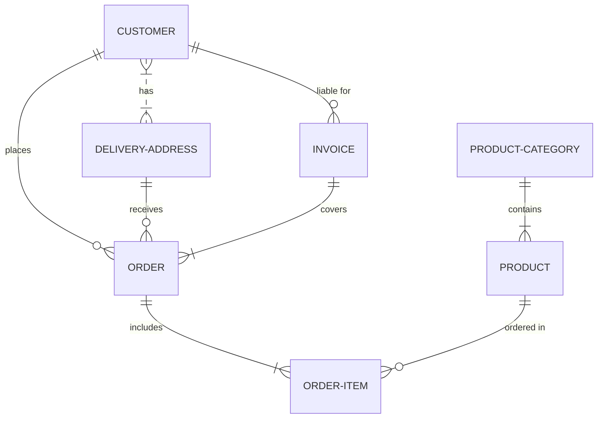

# Proyecto de Estudio!
    
**Estructura del documento principal:**

# PRESENTACIÓN (Título/Nombre Proyecto)

**Asignatura**: Bases de Datos I (FaCENA-UNNE)

**Integrantes**:
 - Beck, Pablo 
 - Belucci, Lautaro
 - Hamm, Abdul
 - Silva, Estela Maris

**Año**: 2024

## CAPÍTULO I: INTRODUCCIÓN

### Caso de estudio

Una clínica veterinaria desea implementar una base de datos para gestionar la información de
sus pacientes (mascotas), dueños, citas médicas y tratamientos. 

- Cada mascota tiene un código único de identificación. Se desea almacenar el nombre,
especie (perro, gato, ave, etc.), raza, fecha de nacimiento, peso y cualquier condición
médica especial en caso de existir. Ej: Alérgico a droga (Nombre droga) 
- Los dueños de las mascotas son registrados con un número de identificación único.
Además, se almacenan datos personales como DNI, nombre, dirección, teléfono y
correo electrónico. 
- Las citas medicas son espontaneas y se registran al momento de la visita de la mascota
a la veterinaria. 
- Se registra el motivo de la cita, el veterinario asignado y cualquier observación posterior
a la cita. Una cita está asociada a una única mascota y a un único veterinario. 
- De cada veterinario se desea guardar su número de licencia profesional, nombre
completo, especialidad (si la tiene, por ejemplo, ortopedia, oftalmología, etc.) y horario
de atención. 
- Si a una mascota se le prescribe un tratamiento, se desea registrar el nombre del
tratamiento, duración, Medicamentos indicados y cualquier otra indicación relevante. 
- El tratamiento, en caso de existir, debe estar asociado a una cita. 
- En una misma cita, el veterinario puede indicar mas de un tratamiento. 
- Un tratamiento debe permitir la aplicación de varios medicamentos 
- De los medicamentos se necesita conocer: Nombre comercial, monodroga, presentación
y laboratorio que lo comercializa. 

### Definición o planteamiento del problema

Pellentesque interdum aliquam magna sit amet rutrum. Nulla aliquam ligula nec quam iaculis dictum. In cursus aliquam cursus. Nullam a sem vel sapien iaculis finibus. Donec aliquam dictum viverra. Etiam ut orci lacus.

## CAPITULO II: MARCO CONCEPTUAL O REFERENCIAL

**TEMA 1 " ---- "** 
Ut sed imperdiet risus. Maecenas vestibulum arcu vitae orci pretium pharetra. Suspendisse potenti. Fusce massa libero, fermentum eget elit in, tincidunt fermentum nunc. Cras imperdiet nisl elit, elementum gravida enim accumsan vel. Sed in sapien quis ante consectetur commodo id non nulla. Aenean lacinia, dolor convallis semper mattis, ante orci elementum nunc, eget feugiat risus neque in urna. Ut ut quam nec risus mollis convallis ornare ac odio. Phasellus efficitur posuere nibh, eget tempor augue pellentesque ac. Ut enim sem, imperdiet non est ut, blandit posuere dui. Curabitur at purus orci. Interdum et malesuada fames ac ante ipsum primis in faucibus.

**TEMA 2 " ----- "** 
Ut sed imperdiet risus. Maecenas vestibulum arcu vitae orci pretium pharetra. Suspendisse potenti. Fusce massa libero, fermentum eget elit in, tincidunt fermentum nunc. Cras imperdiet nisl elit, elementum gravida enim accumsan vel. Sed in sapien quis ante consectetur commodo id non nulla. Aenean lacinia, dolor convallis semper mattis, ante orci elementum nunc, eget feugiat risus neque in urna. Ut ut quam nec risus mollis convallis ornare ac odio. Phasellus efficitur posuere nibh, eget tempor augue pellentesque ac. Ut enim sem, imperdiet non est ut, blandit posuere dui. Curabitur at purus orci. Interdum et malesuada fames ac ante ipsum primis in faucibus.

...

## CAPÍTULO III: METODOLOGÍA SEGUIDA 

Donec lobortis tincidunt erat, non egestas mi volutpat in. Cras ante purus, luctus sed fringilla non, ullamcorper at eros.

 **a) Cómo se realizó el Trabajo Práctico**
Vestibulum rutrum feugiat molestie. Nunc id varius augue. Ut augue mauris, venenatis et lacus ut, mattis blandit urna. Fusce lobortis, quam non vehicula scelerisque, nisi enim ultrices diam, ac tristique libero ex nec orci.

 **b) Herramientas (Instrumentos y procedimientos)**
Donec lobortis tincidunt erat, non egestas mi volutpat in. Cras ante purus, luctus sed fringilla non, ullamcorper at eros. Integer interdum id orci id rutrum. Curabitur facilisis lorem sed metus interdum accumsan. 

## CAPÍTULO IV: DESARROLLO DEL TEMA / PRESENTACIÓN DE RESULTADOS 

Maecenas molestie lacus tincidunt, placerat dolor et, ullamcorper erat. Mauris tortor nisl, ultricies ac scelerisque nec, feugiat in nibh. Pellentesque interdum aliquam magna sit amet rutrum. 

### Diagrama conceptual (opcional)
Ejemplo usando Live Editor https://mermaid.js.org/ (ejemplo opcional)

### Diagrama relacional

### Diccionario de datos

Acceso al documento [PDF](doc/diccionario_datos.pdf) del diccionario de datos.

### Desarrollo TEMA 1 "----"

Fusce auctor finibus lectus, in aliquam orci fermentum id. Fusce sagittis lacus ante, et sodales eros porta interdum. Donec sed lacus et eros condimentum posuere. 

> Acceder a la siguiente carpeta para la descripción completa del tema [scripts-> tema_1](script/tema01_nombre_tema)

### Desarrollo TEMA 2 "----"

Proin aliquet mauris id ex venenatis, eget fermentum lectus malesuada. Maecenas a purus arcu. Etiam pellentesque tempor dictum. 

> Acceder a la siguiente carpeta para la descripción completa del tema [scripts-> tema_2](script/tema02_nombre_tema)

... 

## CAPÍTULO V: CONCLUSIONES

Nunc sollicitudin purus quis ante sodales luctus. Proin a scelerisque libero, vitae pharetra lacus. Nunc finibus, tellus et dictum semper, nisi sem accumsan ligula, et euismod quam ex a tellus. 

## BIBLIOGRAFÍA DE CONSULTA

 1. List item
 2. List item
 3. List item
 4. List item
 5. List item

