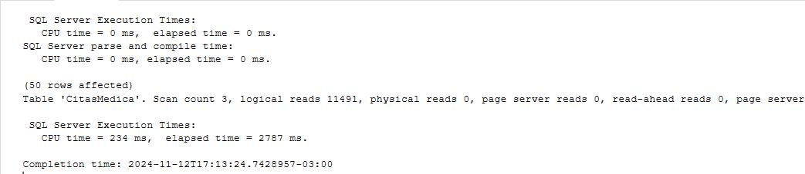
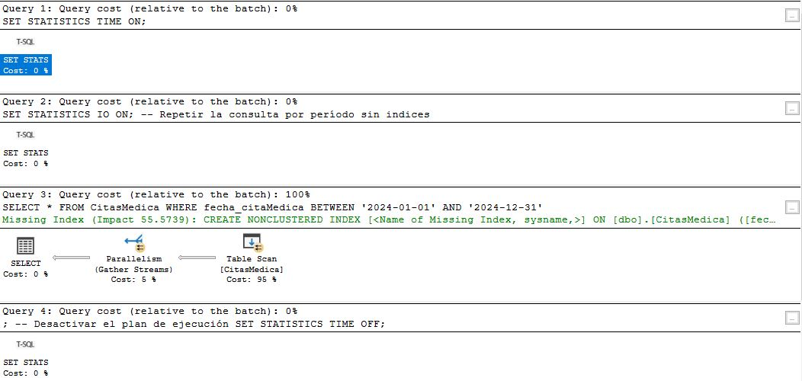
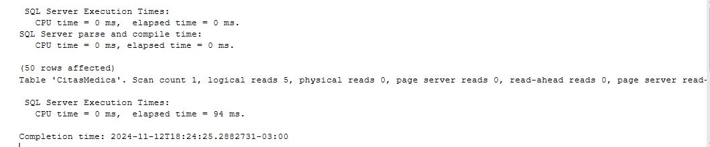
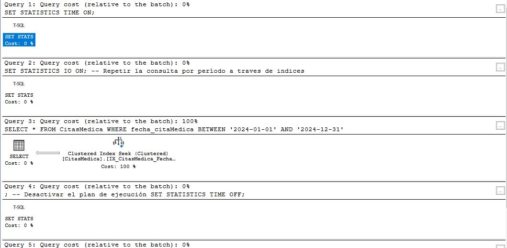
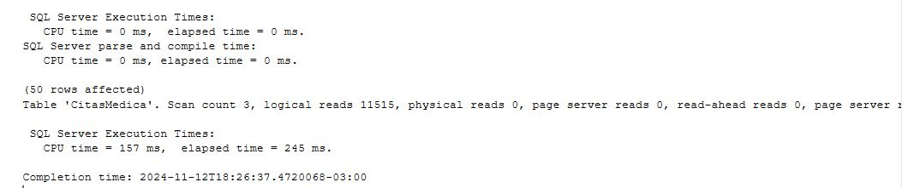
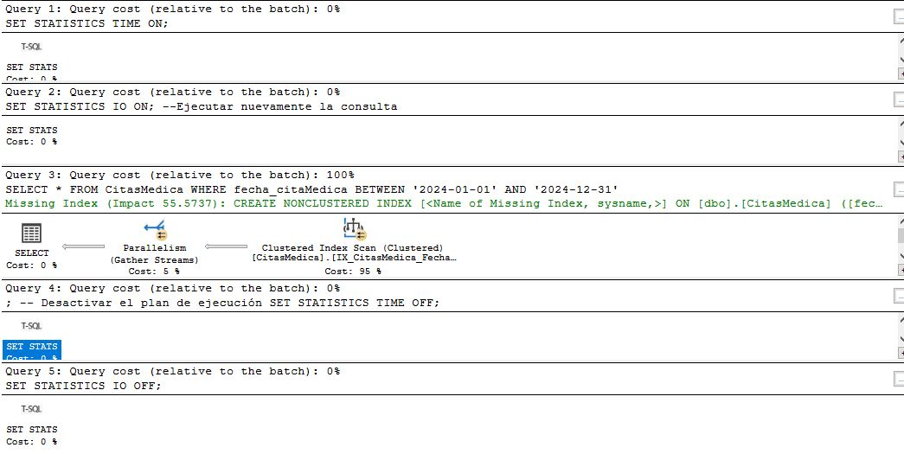

# TEMA 3 : Optimización de Consultas a través de Índices 

## **Introduccion**:  
Un índice en una base de datos es una estructura adicional, es una estructura de disco asociada y contiene claves generadas a partir de una o varias columnas de la tabla o la vista. Dichas claves están almacenadas en una estructura (árbol b) que permite que SQL Server busque de forma rápida y eficiente la fila o filas asociadas a los valores de cada clave. 

### Agrupado 

Los índices clúster ordenan y almacenan las filas de los datos de la tabla o vista de acuerdo con los valores de la clave del índice. Estos valores clave son las columnas incluidas en la definición del índice. Solo puede haber un índice clúster por cada tabla, porque las filas de datos solo pueden estar almacenadas de una forma.
La única ocasión en la que las filas de datos de una tabla están ordenadas es cuando la tabla contiene un índice clúster. Cuando una tabla tiene un índice clúster, la tabla se denomina tabla agrupada. Si una tabla no tiene un índice clúster, sus filas de datos están almacenadas en una estructura sin ordenar denominada montón.

### Ventajas: 
Las consultas que ordenan o filtran por la clave del índice agrupado suelen ser más rápidas porque las filas de datos ya están ordenadas según la clave del índice.

### No agrupado 
Los índices no clúster tienen una estructura separada de las filas de datos. Un índice no clúster contiene los valores de clave de índice no clúster y cada entrada de valor de clave tiene un puntero a la fila de datos que contiene el valor clave.

El puntero de una fila de índice no clúster hacia una fila de datos se denomina localizador de fila. La estructura del localizador de filas depende de si las páginas de datos están almacenadas en un montón o en una tabla agrupada. Si están en un montón, el localizador de filas es un puntero hacia la fila. Si están en una tabla agrupada, el localizador de fila es la clave de índice clúster.

Puede agregar columnas sin clave al nivel hoja de un índice no agrupado con el fin de eludir los límites existentes para las claves de índice, así como para ejecutar consultas totalmente cubiertas. Para más información, vea Creación de índices con columnas incluidas.

### Ventajas: 
Los índices no agrupados permiten crear varios índices en una tabla, lo que mejora la eficiencia en las consultas que no se benefician del índice agrupado.
Pueden incluir columnas adicionales en el nivel hoja (columnas incluidas) para evitar los límites de las claves de índice y mejorar el rendimiento en consultas que requieren todas las columnas de la tabla.
Tanto los índices clúster como los no clúster pueden ser únicos. Esto significa que con un índice único, dos filas no pueden tener el mismo valor para la clave de índice. De lo contrario, el índice no es único y varias filas pueden compartir el mismo valor de clave.

### Índices y restricciones 
Los índices se crean automáticamente cuando las restricciones PRIMARY KEY y UNIQUE se definen en las columnas de tabla. Por ejemplo, cuando crea una tabla con una restricción UNIQUE, el motor de base de datos crea automáticamente un índice no agrupado. Si configura una restricción PRIMARY KEY, el motor de base de datos crea automáticamente un índice agrupado, a menos que ya exista uno. Cuando intenta aplicar una restricción PRIMARY KEY en una tabla existente y ya existe un índice agrupado en esa tabla, SQL Server aplica la clave principal mediante un índice no agrupado.

### Observaciones: 
### CitasMedica (Sin indice)
Rendimiento de la consulta sin índice agrupado: Al ejecutar la consulta sin índice,
el motor de SQL Server tendrá que realizar un escaneo completo de la tabla, lo cual puede ser lento si la tabla tiene muchos registros.

### CitasMedica (Con indice) utilizando solo una columna
Mejora con el índice agrupado sobre fecha_nacimiento: 
Crear un índice agrupado sobre fecha_nacimiento mejora el rendimiento de las consultas que filtran por esa columna, 
ya que los datos estarán físicamente ordenados por esa columna, lo que permite un acceso más rápido.

### CitasMedica (Con indice) utilizando mas de una columna
Mejora adicional con el índice agrupado que incluye las columnas seleccionadas: 
Incluir las columnas adicionales en el índice agrupado mejora aún más el rendimiento, ya que cubre toda la consulta. 
Esto significa que SQL Server no tiene que realizar una búsqueda adicional de datos en la tabla; 
toda la información necesaria está contenida en el índice.

Impacto de los planes de ejecución: El plan de ejecución mostrará cambios en la forma en que SQL Server accede a los datos.
Con un índice agrupado, deberías ver que se está utilizando un índice de búsqueda más eficiente en lugar de un escaneo de tabla.

Tiempos de respuesta: Los tiempos de respuesta deberían disminuir considerablemente después de crear el índice,
y más aún con el índice cubierto que incluye las columnas seleccionadas.

## Conclusiones: 
AL crear un índice agrupado sobre una  columna, como fecha_nacimiento, mejora la eficiencia de la consulta.
Pero si se  crea un índice utilizando mas columnas, el rendimiento mejorará aún más, 
ya que SQL Server utilizará solo el índice para resolver la consulta sin tener que acceder a la tabla principal.

