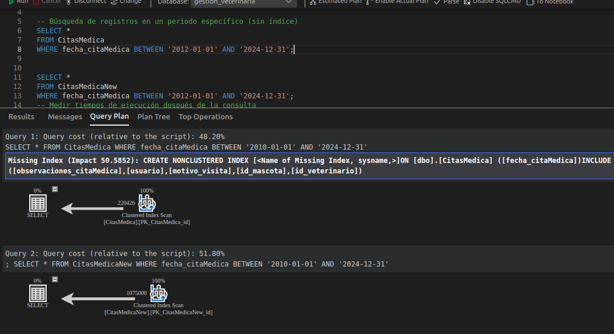
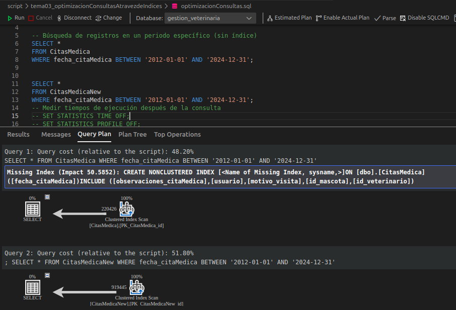

# TEMA 3 : Optimización de Consultas a través de Índices 

## **Introduccion**:  
Un índice en una base de datos es una estructura adicional que se crea para permitir búsquedas rápidas en una o varias columnas de una tabla. Actúa como un índice en un libro, permitiendo encontrar información rápidamente sin tener que recorrer toda la tabla.

## **Pruebas**:  
### CitasMedica (Sin indice) vs CitasMedicaNew (con indice agrupado por (fecha_citaMedica, id_mascota, id_veterinario))

### CitasMedica (Sin indice) vs CitasMedicaNew (con indice agrupado por (fecha_citaMedica))

### CitasMedica (con indice agrupado por (fecha_citaMedica, id_mascota, id_veterinario)) vs CitasMedicaNew (con indice agrupado por (fecha_citaMedica))
